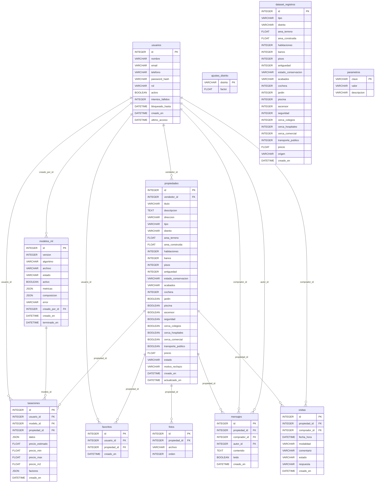

# Modelo de datos

## Diagrama entidad-relación

## Diccionario de datos

| Tabla | Campo | Tipo | Nulo | Clave |
|---|---|---|---|---|
| ajustes_distrito | distrito | VARCHAR(60) | no | PK |
| ajustes_distrito | factor | FLOAT | no |  |
| dataset_registros | id | INTEGER | no | PK |
| dataset_registros | tipo | VARCHAR(20) | no |  |
| dataset_registros | distrito | VARCHAR(60) | no |  |
| dataset_registros | area_terreno | FLOAT | no |  |
| dataset_registros | area_construida | FLOAT | no |  |
| dataset_registros | habitaciones | INTEGER | no |  |
| dataset_registros | banos | INTEGER | no |  |
| dataset_registros | pisos | INTEGER | no |  |
| dataset_registros | antiguedad | INTEGER | no |  |
| dataset_registros | estado_conservacion | VARCHAR(20) | no |  |
| dataset_registros | acabados | VARCHAR(20) | no |  |
| dataset_registros | cochera | INTEGER | no |  |
| dataset_registros | jardin | INTEGER | no |  |
| dataset_registros | piscina | INTEGER | no |  |
| dataset_registros | ascensor | INTEGER | no |  |
| dataset_registros | seguridad | INTEGER | no |  |
| dataset_registros | cerca_colegios | INTEGER | no |  |
| dataset_registros | cerca_hospitales | INTEGER | no |  |
| dataset_registros | cerca_comercial | INTEGER | no |  |
| dataset_registros | transporte_publico | INTEGER | no |  |
| dataset_registros | precio | FLOAT | no |  |
| dataset_registros | origen | VARCHAR(15) | no |  |
| dataset_registros | creado_en | DATETIME | no |  |
| parametros | clave | VARCHAR(60) | no | PK |
| parametros | valor | VARCHAR(60) | no |  |
| parametros | descripcion | VARCHAR(200) | no |  |
| usuarios | id | INTEGER | no | PK |
| usuarios | nombre | VARCHAR(120) | no |  |
| usuarios | email | VARCHAR(160) | no |  |
| usuarios | telefono | VARCHAR(30) | sí |  |
| usuarios | password_hash | VARCHAR(255) | no |  |
| usuarios | rol | VARCHAR(20) | no |  |
| usuarios | activo | BOOLEAN | no |  |
| usuarios | intentos_fallidos | INTEGER | no |  |
| usuarios | bloqueado_hasta | DATETIME | sí |  |
| usuarios | creado_en | DATETIME | no |  |
| usuarios | ultimo_acceso | DATETIME | sí |  |
| modelos_ml | id | INTEGER | no | PK |
| modelos_ml | version | INTEGER | no |  |
| modelos_ml | algoritmo | VARCHAR(30) | sí |  |
| modelos_ml | archivo | VARCHAR(120) | sí |  |
| modelos_ml | estado | VARCHAR(12) | no |  |
| modelos_ml | activo | BOOLEAN | no |  |
| modelos_ml | metricas | JSON | sí |  |
| modelos_ml | composicion | JSON | sí |  |
| modelos_ml | error | VARCHAR(400) | sí |  |
| modelos_ml | creado_por_id | INTEGER | sí | FK → usuarios.id |
| modelos_ml | creado_en | DATETIME | no |  |
| modelos_ml | terminado_en | DATETIME | sí |  |
| propiedades | id | INTEGER | no | PK |
| propiedades | vendedor_id | INTEGER | no | FK → usuarios.id |
| propiedades | titulo | VARCHAR(160) | no |  |
| propiedades | descripcion | TEXT | no |  |
| propiedades | direccion | VARCHAR(200) | no |  |
| propiedades | tipo | VARCHAR(20) | no |  |
| propiedades | distrito | VARCHAR(60) | no |  |
| propiedades | area_terreno | FLOAT | no |  |
| propiedades | area_construida | FLOAT | no |  |
| propiedades | habitaciones | INTEGER | no |  |
| propiedades | banos | INTEGER | no |  |
| propiedades | pisos | INTEGER | no |  |
| propiedades | antiguedad | INTEGER | no |  |
| propiedades | estado_conservacion | VARCHAR(20) | no |  |
| propiedades | acabados | VARCHAR(20) | no |  |
| propiedades | cochera | INTEGER | no |  |
| propiedades | jardin | BOOLEAN | no |  |
| propiedades | piscina | BOOLEAN | no |  |
| propiedades | ascensor | BOOLEAN | no |  |
| propiedades | seguridad | BOOLEAN | no |  |
| propiedades | cerca_colegios | BOOLEAN | no |  |
| propiedades | cerca_hospitales | BOOLEAN | no |  |
| propiedades | cerca_comercial | BOOLEAN | no |  |
| propiedades | transporte_publico | BOOLEAN | no |  |
| propiedades | precio | FLOAT | no |  |
| propiedades | estado | VARCHAR(15) | no |  |
| propiedades | motivo_rechazo | VARCHAR(300) | sí |  |
| propiedades | creado_en | DATETIME | no |  |
| propiedades | actualizado_en | DATETIME | no |  |
| favoritos | id | INTEGER | no | PK |
| favoritos | usuario_id | INTEGER | no | FK → usuarios.id |
| favoritos | propiedad_id | INTEGER | no | FK → propiedades.id |
| favoritos | creado_en | DATETIME | no |  |
| fotos | id | INTEGER | no | PK |
| fotos | propiedad_id | INTEGER | no | FK → propiedades.id |
| fotos | archivo | VARCHAR(120) | no |  |
| fotos | orden | INTEGER | no |  |
| mensajes | id | INTEGER | no | PK |
| mensajes | propiedad_id | INTEGER | no | FK → propiedades.id |
| mensajes | comprador_id | INTEGER | no | FK → usuarios.id |
| mensajes | autor_id | INTEGER | no | FK → usuarios.id |
| mensajes | contenido | TEXT | no |  |
| mensajes | leido | BOOLEAN | no |  |
| mensajes | creado_en | DATETIME | no |  |
| tasaciones | id | INTEGER | no | PK |
| tasaciones | usuario_id | INTEGER | no | FK → usuarios.id |
| tasaciones | modelo_id | INTEGER | sí | FK → modelos_ml.id |
| tasaciones | propiedad_id | INTEGER | sí | FK → propiedades.id |
| tasaciones | datos | JSON | no |  |
| tasaciones | precio_estimado | FLOAT | no |  |
| tasaciones | precio_min | FLOAT | no |  |
| tasaciones | precio_max | FLOAT | no |  |
| tasaciones | precio_m2 | FLOAT | no |  |
| tasaciones | factores | JSON | no |  |
| tasaciones | creado_en | DATETIME | no |  |
| visitas | id | INTEGER | no | PK |
| visitas | propiedad_id | INTEGER | no | FK → propiedades.id |
| visitas | comprador_id | INTEGER | no | FK → usuarios.id |
| visitas | fecha_hora | DATETIME | no |  |
| visitas | modalidad | VARCHAR(15) | no |  |
| visitas | comentario | VARCHAR(400) | sí |  |
| visitas | estado | VARCHAR(15) | no |  |
| visitas | respuesta | VARCHAR(300) | sí |  |
| visitas | creado_en | DATETIME | no |  |
